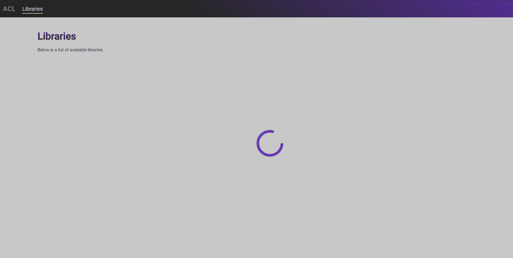

# angular-component-library
[](https://github.com/chapi-chapi/angular-component-library/actions?query=workflow%3ABuild)

[](https://chapi-chapi.github.io/angular-component-library/)



This project was scaffolded using [chapi-chapi/generator-angular](https://github.com/chapi-chapi/generator-angular)

This is a component library for various angular packages.
The project acts as a runnable application that can also be used to generate individual npm packages.
To run locally use:

```npm run start```

This will run a build --watch against all projects and also serve the app in parallel.

Check out [the Wiki for more info](https://github.com/chapi-chapi/angular-component-library/wiki).

--------------------------------------------------------------------------------------------------------------------------------------------------------

This project was generated with [Angular CLI](https://github.com/angular/angular-cli) version 9.0.3.

## Development server

Run `ng serve` for a dev server. Navigate to `http://localhost:4200/`. The app will automatically reload if you change any of the source files.

## Code scaffolding

Run `ng generate component component-name` to generate a new component. You can also use `ng generate directive|pipe|service|class|guard|interface|enum|module`.

## Build

Run `ng build` to build the project. The build artifacts will be stored in the `dist/` directory. Use the `--prod` flag for a production build.

## Running unit tests

Run `ng test` to execute the unit tests via [Karma](https://karma-runner.github.io).

## Running end-to-end tests

Run `ng e2e` to execute the end-to-end tests via [Protractor](http://www.protractortest.org/).

## Further help

To get more help on the Angular CLI use `ng help` or go check out the [Angular CLI README](https://github.com/angular/angular-cli/blob/master/README.md).
